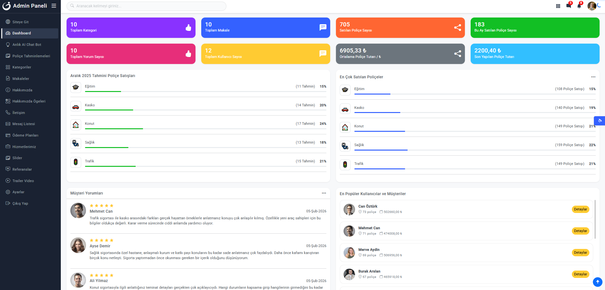
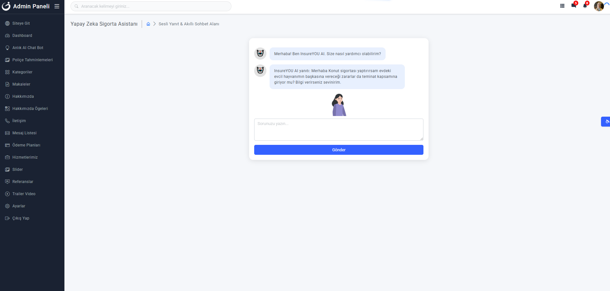
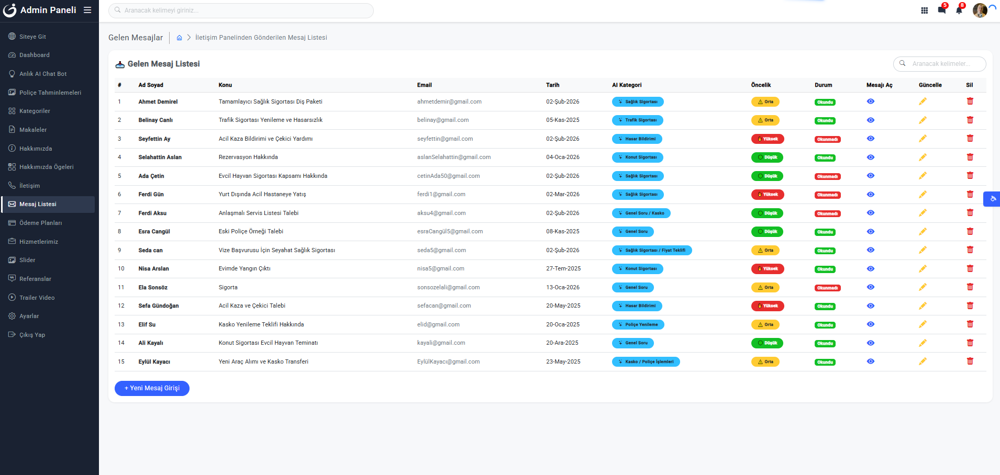
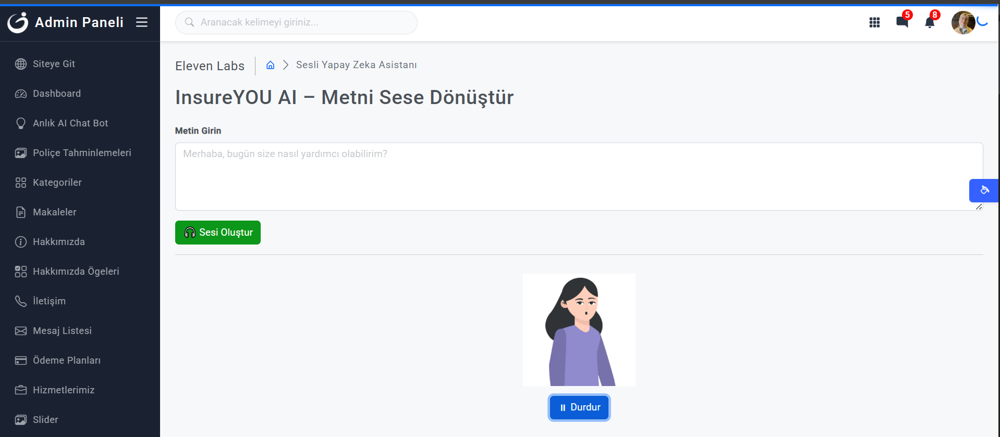
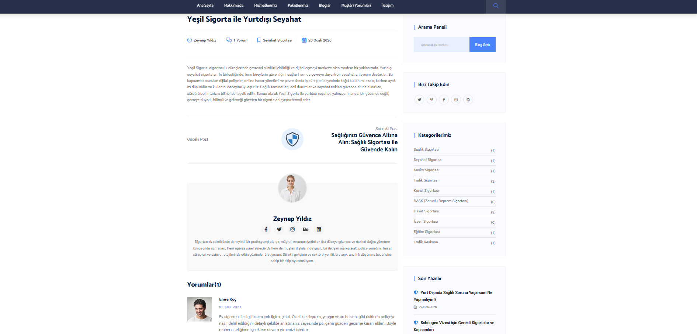
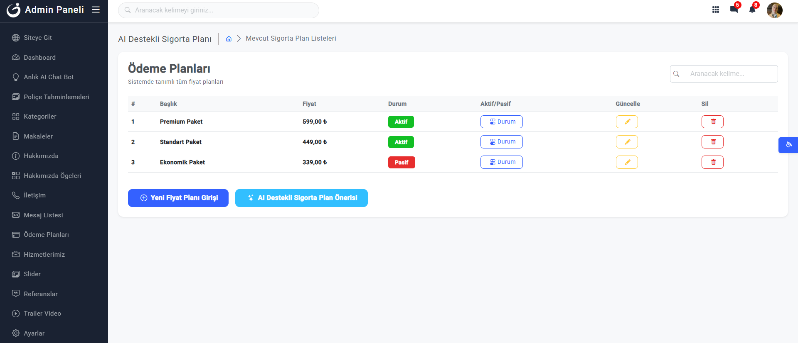
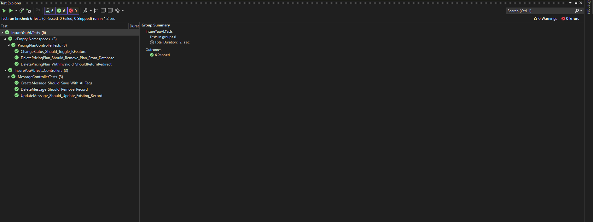

# 🛡️ InsureYouAI – ASP.NET Core 8 Yapay Zeka Destekli Sigorta Portalı

**InsureYouAI**, sigortacılık sektörü için geliştirilen,  
**yapay zeka destekli içerik üretimini ve yönetimini** merkeze alan bir  
**ASP.NET Core 8 MVC** tabanlı web uygulamasıdır.

Proje; başta **OpenAI**, **Google Gemini**, **Anthropic Claude**, **Hugging Face**,  
**Tavily AI** ve **ElevenLabs** olmak üzere farklı **LLM ve AI servislerinin**  
entegrasyonuna uygun şekilde tasarlanmıştır.

> 📌 Proje geliştirme süreci tamamlanmış olup, mevcut haliyle  
> **uçtan uca çalışan bir AI destekli sigorta portalıdır**.

---

## 🛠 Kullanılan Teknolojiler

- **Backend:** ASP.NET Core 8 MVC  
- **Identity:** ASP.NET Core Identity  
- **ORM:** Entity Framework Core  
- **Database:** MS SQL Server  
- **Logging:** Serilog  
- **Testing:** xUnit, Moq, EF Core InMemory  
- **AI & ML Entegrasyonları:**  
  - OpenAI API  
  - Google Gemini API  
  - Anthropic Claude API  
  - Hugging Face API  
  - Tavily AI  
  - ElevenLabs  
  - ML.NET & Microsoft.ML.TimeSeries  
- **Frontend:** Razor Views, Bootstrap 5, Bootstrap Icons  

---

## ✨ Mevcut Özellikler 

- ✅ **Dinamik Dashboard & Grafik Yönetimi**
- ✅ **ML.NET Time Series Forecasting (SSA)**
- ✅ **AI Destekli Mesaj Yönetimi & Otomatik Yanıt**
- ✅ **Çoklu Yapay Zeka Entegrasyonu**
- ✅ **AI Destekli Görsel Üretimi**
- ✅ **Admin Paneli & CRUD Operasyonları**
- ✅ **Blog & Yorum Yönetimi**
- ✅ **Pricing Plan Aktif / Pasif Yönetimi**

---

## 🧪 Unit Test Altyapısı

Projede **xUnit** tabanlı unit test yapısı kurulmuştur.

### Kullanılan Test Yaklaşımı
- **EF Core InMemory Database** ile izole test ortamı
- **Moq** ile AI servislerinin mocklanması
- Controller bazlı test senaryoları:
  - Create
  - Update
  - Delete
  - AI etiketleme doğrulamaları

Örnek test edilen alanlar:
- Mesaj oluşturma (AI kategori & öncelik)
- Mesaj güncelleme
- Mesaj silme işlemleri

Bu yapı sayesinde:
- Veritabanına bağımlı olmayan
- Hızlı ve güvenilir testler
elde edilmiştir.

---

## 📝 Loglama (Serilog)

Projede **Serilog** ile merkezi loglama altyapısı kurulmuştur.

### Loglanan İşlemler
- HTTP Request / Response logları
- Sayfa ziyaretleri
- CRUD işlemleri
- Pricing Plan **Aktif / Pasif** durum değişiklikleri
- Hata (Exception) logları

### Log Özellikleri
- Günlük bazlı **rolling file** loglama
- Ortamdan bağımsız yapı
- İleride Seq / Elasticsearch entegrasyonuna uygun

### Log Dosya Yapısı
Loglar uygulama çalıştığı süre boyunca otomatik olarak üretilir ve
günlük bazlı dosyalanır.

```text
Logs/
 └── log-YYYYMMDD.txt
```
ℹ️ Log dosyaları güvenlik ve boyut yönetimi nedeniyle
GitHub reposuna dahil edilmemiştir.

---


## 🤖 Yapay Zeka Entegrasyonları (Özet)

- **OpenAI:** İçerik ve makale üretimi
- **Google Gemini:** Statik ve kurumsal içerikler
- **Anthropic Claude:** PDF analiz & mesaj yanıtları
- **Hugging Face:** Duygu analizi & moderasyon
- **Tavily AI:** Gerçek zamanlı web arama
- **ElevenLabs:** Metin seslendirme & sesli asistan
- **ML.NET:** Satış tahminleme (Time Series – SSA)

---

## 📸 Uygulama Görselleri

<details>
<summary>🏠 Anasayfa</summary>


</details>

<details>
<summary>📊 Dashboard</summary>



</details>

<details>
<summary>💬 Chat AI</summary>



</details>

<details>
<summary>📩 Mesaj Listesi</summary>



</details>

<details>
<summary>🧠 Sesli AI Asistan</summary>



</details>

<details>
<summary>📄 Yorum Detay & AI Analiz</summary>



</details>

<details>
<summary>📦 Pricing Plan (Aktif / Pasif Yönetimi)</summary>



</details>

<details>
<summary>🧪 Unit Test Ekranı</summary>



</details>

---

## ⚙️ Kurulum ve Çalıştırma

1. Projeyi klonlayın:
   ```bash
   git clone https://github.com/SevilayOnogul/InsureYouAI.git
2. `appsettings.json` dosyasındaki **Connection String** bilgisini güncelleyin.
3. Package Manager Console üzerinden `Update-Database` komutunu çalıştırın.
4. Projeyi çalıştırın: `Ctrl + F5`
5. **API Yapılandırması:**  
   `appsettings.json` dosyası içerisindeki **OpenAI**, **Google Gemini** ve  
   **Hugging Face** API anahtar alanlarını kendi lisans anahtarlarınızla doldurun.

> ℹ️ Güvenlik nedeniyle API anahtarları projede varsayılan olarak boş bırakılmıştır.  
> 🧠 Bu proje, modern web geliştirme ve yapay zeka entegrasyonlarının birlikte nasıl tasarlanabileceğini göstermek amacıyla geliştirilmiştir.
